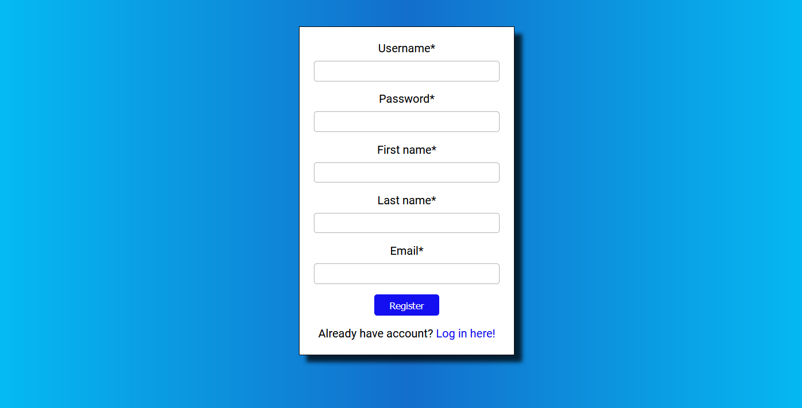
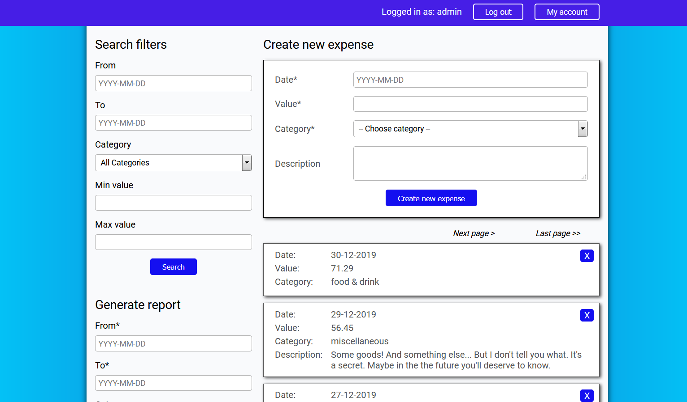
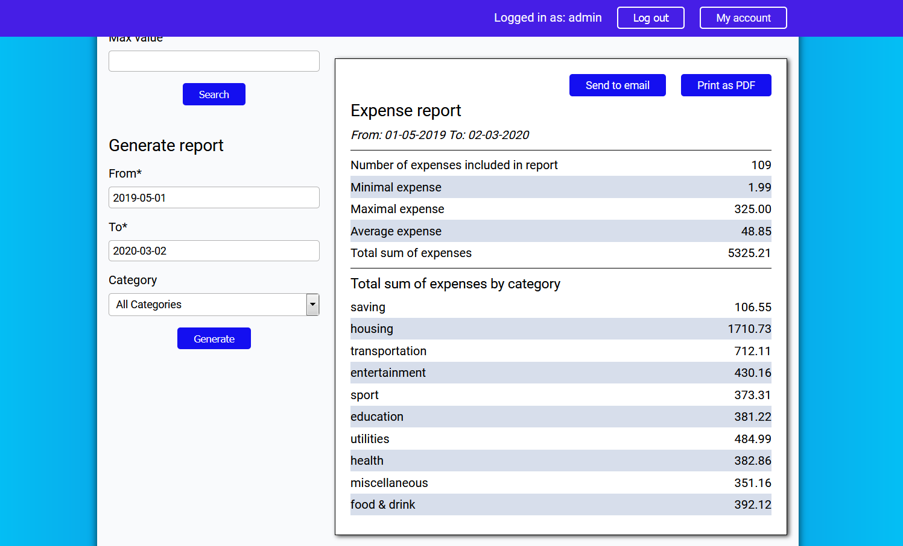

# Expense manager

Light web application helping you manage your expenses.

## Table of contents

* [General info](#general-info)
* [Technologies](#technologies)
* [Architecture](#architecture)
* [Features](#features)
* [Screenshots](#screenshots)

## General info

Expense manager is a web application that allows you to add and browse your expenses.
Every user needs to create their own account. There is a possibility to search expenses
by date, category or value. Another option is generating periodic reports. Each report 
includes summary of your expenses e.g. min/max/avg/sum of expenses, listing of expenses
by category. Report can be generated as PDF file and sent to your email account.

## Technologies

Project is created with:
* Java 11
* Spring Boot
* Spring Data
* Spring Security
* Hibernate
* Thymeleaf

## Architecture

Application is written using CQRS pattern. Every action leading to change of the application state
is represented by a command object (simple POJO) holding all required information. Then it is passed 
to the command dispatcher. Command dispatcher retrieves appropriate command handler from 
the application context. Command handlers are simple application services that process commands.
Application is divided into two main modules: expenses and users.

## Features

* Registering users accounts with confirmation by email
* Forgot password functionality
* Creating expenses
* Filtering expenses by dates, categories and values
* Generating periodic reports
* Creating report in PDF format
* Sending reports to email

## Screenshots

